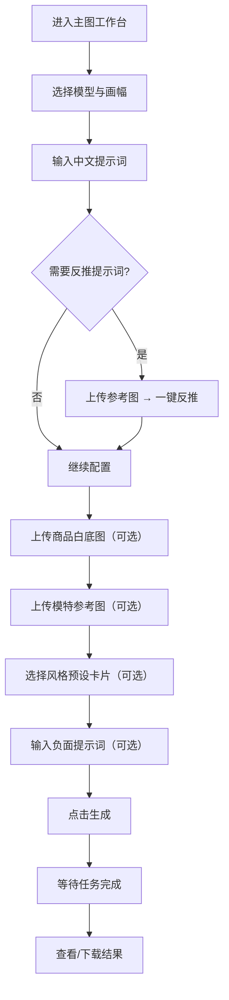
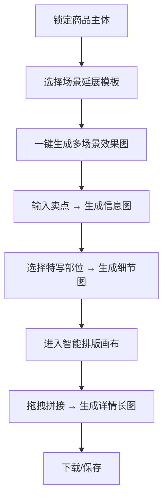

## 1. 产品概述

Visual Forge Web 工作台是基于 Visual Forge 双引擎架构的专业级 AI 视觉生成 Web 应用。面向电商卖家、设计师和内容创作者，提供低门槛、高可控的商品图与视觉物料生成方案。产品将原有的命令行工具升级为可视化工作台，覆盖主图生成、详情页排版、灵感画廊三大核心场景。

## 2. 核心功能

### 2.1 用户角色

| 角色 | 注册方式 | 核心权限 |
|------|----------|----------|
| 普通用户 | 无需注册（本地/云端密钥配置） | 全部功能 |

### 2.2 功能模块总览

1. **主图生成工作台**：模型与画幅配置、提示词输入与反推、参考图管理、高级生成控制
2. **详情页生成画布**：场景化延展、信息图生成、细节特写、智能排版拼接
3. **灵感画廊与资产库**：可视化风格库、草稿箱与生成历史、云端资产管理
4. **系统设置**：API 密钥管理、任务队列状态监控

### 2.3 页面详情

| 页面名称 | 模块名称 | 功能描述 |
|----------|----------|----------|
| 主图生成工作台 | 模型与引擎选择 | 下拉切换底层模型（Gemini-3-Pro、gpt-image-2、nano-banana 等），支持主备引擎自动 Fallback |
| 主图生成工作台 | 画幅控制 | 预设常用电商比例（1:1 淘宝主图、3:4 小红书、16:9 PC端），支持分辨率选择（1K/2K/4K） |
| 主图生成工作台 | 提示词输入 | 中文自然语言输入，自动调用 LLM 优化为英文 Prompt；支持手动编辑英文 Prompt |
| 主图生成工作台 | 反推提示词 | 上传竞品图/参考图，一键解析提取画面构图、光影、风格的提示词 |
| 主图生成工作台 | 商品主体输入 | 上传白底图正反面作为商品主体约束，保持商品特征不变形 |
| 主图生成工作台 | 模特/姿势参考 | 上传模特参考图，指定生成人物的姿态、构图或风格 |
| 主图生成工作台 | 风格预设卡片 | 28 种预设风格（极简黑白、赛博科技、温暖治愈等）可视化卡片，一键套用 |
| 主图生成工作台 | 负面提示词 | 输入框排除不想要的元素（多余手指、水印、文字等） |
| 详情页生成画布 | 场景化延展 | 基于锁定的商品主体，一键生成多个场景效果图（办公桌、露营、车载等） |
| 详情页生成画布 | 信息图模式 | 输入商品卖点，自动生成带引线标注、爆炸图效果的高信息密度详情页模块 |
| 详情页生成画布 | 细节特写生成 | 针对材质（皮质纹理、金属拉丝）和局部接口（Type-C、按钮）提供微距渲染 |
| 详情页生成画布 | 智能排版画布 | Web 画布将场景图、卖点图、特写图自动拼接为连贯长图；预留文案排版空间 |
| 灵感画廊 | 可视化风格库 | 动态风格卡片，按行业、色系筛选；继承 style-gallery.html 并升级为动态组件 |
| 灵感画廊 | 草稿箱与历史 | 记录每次生成 Seed、提示词、参数组合；支持"一键同款"复用参数 |
| 灵感画廊 | 云端资产管理 | 本地资产对接 OSS 上传，生成稳定 URL 供多次复用 |
| 系统设置 | API 密钥管理 | 配置弹窗映射 .env 变量（Yunwu / Grsai API Key） |
| 系统设置 | 任务队列状态 | 生图进度 Loading 动画、排队进度条、失败自动重试提示 |

## 3. 核心流程

### 3.1 主图生图流程

### 3.2 详情页排版流程

## 4. 用户界面设计

### 4.1 设计风格

- **色彩方案**：深色工业科技风为主基调（深灰蓝 #0d0f1a 背景），霓虹青色 #00e5ff 和活力橙 #ff6b35 作为强调色，营造专业工具型应用的沉浸感和科技感
- **字体**：标题使用 "Orbitron"（几何科技字体），正文使用 "Noto Sans SC"（中文优化无衬线字体）
- **按钮风格**：半透明磨砂玻璃效果，悬浮时霓虹边框发光；主操作按钮渐变填充；次要按钮描边半透明
- **布局风格**：左侧固定导航 + 右侧多标签页内容区，卡片式组织各功能模块
- **图标**：lucide-react 线性图标，统一粗细，与霓虹青色配色一致

### 4.2 页面设计概览

| 页面名称 | 模块名称 | UI 元素 |
|----------|----------|---------|
| 主图工作台 | 模型选择器 | 下拉选择 + 当前选中模型展示卡片（名称、引擎标签、能力描述） |
| 主图工作台 | 画幅控制 | 可点击比例预设按钮组 + 分辨率滑块（1K/2K/4K） |
| 主图工作台 | 提示词输入 | 左侧中文 textarea + 右侧英文翻译预览（只读可编辑）；"优化翻译"按钮；"反推提示词"按钮 |
| 主图工作台 | 参考图区 | 双标签页：商品白底图 / 模特参考图；拖拽上传区 + 缩略图预览 |
| 主图工作台 | 风格选择 | 水平滚动卡片列表，卡片显示风格名称和颜色渐变预览；选中发光边框 |
| 主图工作台 | 高级控制 | 负面提示词输入框 + 风格强度滑块 |
| 详情页画布 | 场景选择 | 场景模板网格卡片 + 自定义场景输入 |
| 详情页画布 | 信息图配置 | 卖点列表输入（可添加多条） + 信息图风格选择 |
| 详情页画布 | 智能排版 | Canvas 画布区域 + 已生成素材缩略图侧栏 + 排版模板选择 |
| 灵感画廊 | 风格库 | 网格/列表切换 + 行业/色系筛选标签 + 风格卡片 |
| 灵感画廊 | 草稿箱 | 时间线列表 + 缩略图 + 一键同款按钮 |
| 系统设置 | 密钥管理 | 表单弹窗 + 测试连接按钮 + 密钥脱敏显示 |

### 4.3 响应式设计

- **桌面端（≥1280px）**：左侧导航 + 右侧多列内容区，完整功能展示
- **平板端（768-1279px）**：折叠导航为图标模式，内容区两列布局，画布区域全宽
- **移动端（<768px）**：底部标签栏导航，单列堆叠布局，关键功能优先展示
