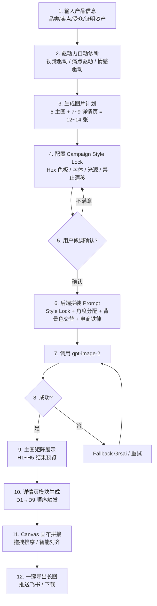

# 全链路电商 AI 视觉物料工作台 — 产品需求文档 v3.0

> 融合 `ecom-details-image`（大脑） + `visual-forge`（肉体）的全新专业级电商视觉工作台

---

## 1. 产品定位与融合策略

### 1.1 产品定义

**全链路电商 AI 视觉物料工作台** 是基于 Visual Forge 双引擎架构的专业级 Web 应用。面向淘宝/抖音/天猫电商卖家、品牌视觉设计师和代运营团队，提供从"转化策略诊断 → 全套风格锁定 → 批量主图/详情页生图 → 智能排版拼接 → 自动化交付"的一站式闭环。

### 1.2 融合取长补短矩阵

| 能力域 | 来源 | 说明 |
|--------|------|------|
| **转化驱动力诊断引擎** | ecom-details-image | 视觉驱动 / 痛点驱动 / 情感驱动三大类型自动判别 |
| **Campaign Style Lock**（10 字段风格锁） | ecom-details-image | 限制 Hex 色板、字体、光源、布局，防止风格漂移 |
| **GPT-Image-2 生图 7 条铁律** | ecom-details-image | Hex 色、数字占比、显式留白、否定清单、平台预留 |
| **多角度镜头分配系统** | ecom-details-image | 6 种角度 + 5 种景别 + 全景 ≤40% + 不可连 3 张同角度 |
| **详情页 9 屏信息图模块** | ecom-details-image | D1-D9 每屏有强制电商信息图结构 |
| **背景色交替规则** | ecom-details-image | #FFFFFF → #F5F1E8 → 品牌深色交替 |
| **25 场景模板库** | ecom-details-image | JSON 驱动的场景模板系统 |
| **可视化 Web 工作台** | visual-forge | React + TypeScript + 左侧配置/右侧预览 |
| **双引擎 Fallback 容灾** | visual-forge | yunwu (Gemini) → grsai (gpt-image-2) 自动切换 |
| **OSS 自动上云** | visual-forge | 本地白底图/模特图自动 OSS 转 URL |
| **智能拼图画布 (Canvas)** | visual-forge | 9:16 长流画布，拖拽拼接详情页模块 |
| **草稿箱 + 历史归档** | visual-forge | localStorage 持久化 + Seed/Prompt 完整记录 |

### 1.3 放弃与降级

| 删除项 | 原因 |
|--------|------|
| PPT 幻灯片模式（ppt_retro_pop 等） | 与电商场景无关 |
| 自媒体封面模式（公众号/小红书通用封面） | 弱化为可选的"社媒衍生"子功能 |
| 随机的 Modifier 拼接模式 | 升级为结构化的电商专属参数输入 |
| 28 种通用风格 | 精简为电商 4 大风向（白底棚拍/场景生活/信息图/A+） |

---

## 2. 核心功能矩阵（全模块总览）

### 2.1 四大页面

| 页面 | 路由 | 定位 |
|------|------|------|
| **策略控制中心** | `/` | 转化诊断 + Style Lock + 全链路图片计划预览 |
| **主图/副图矩阵工作台** | `/studio` | 5 张主图堆栈配置 + 电商合规开关 + 图生图参考 |
| **智能排版详情画布** | `/canvas` | 9 屏信息图模块生成 + 拖拽拼接长图 |
| **资产画廊与设置** | `/gallery` | 风格库 + 草稿箱 + 历史 + API 配置 |

### 2.2 功能模块详细表

| 页面 | 模块 | 来源 | 核心功能 |
|------|------|------|----------|
| **策略控制中心** | 产品信息输入 | 新 | 品类、卖点列表（动态添加）、受众、证明资产 |
| **策略控制中心** | 驱动力诊断 | ecom-details-image | 自动判断视觉/痛点/情感驱动，激活对应 12 张图序列 |
| **策略控制中心** | 风格锁配置 | ecom-details-image | 10 字段可视化编辑：Hex 色板、冷暖调、字体、光源、布局、图标、禁止漂移项 |
| **策略控制中心** | 图片计划预览表 | ecom-details-image | 12 张图的编号/用途/背景色/角度/信息图结构可视化预览 |
| **主图矩阵** | 5 主图堆栈 | ecom-details-image | H1 首图卖点 / H2 核心特写 / H3 场景匹配 / H4 对比方案 / H5 保障 CTA |
| **主图矩阵** | 电商合规 Overlay | ecom-details-image | 顶部价格区 200×100 + 左上 Logo 角标 200×100 可视化开关 |
| **主图矩阵** | 负面词预设 | ecom-details-image | 电商常用否定清单一键勾选 |
| **主图矩阵** | 商品白底参考上传 | visual-forge | OSS 自动上传 + 图生图 |
| **主图矩阵** | 模特姿势参考上传 | visual-forge | 参考图 URL 传入 API |
| **详情画布** | 9 屏模块生成 | ecom-details-image | D1 首屏承接 → D9 FAQ/CTA 一键顺序生成 |
| **详情画布** | 智能排版 Canvas | visual-forge | 9:16 纵向画布，拖拽排序，智能对齐，背景色交替预览 |
| **详情画布** | 一键导出长图 | visual-forge | 拼接为万级像素详情页长图 |
| **资产画廊** | 风格库 | ecom-details-image | 25 模板可视化卡片，按行业/色系筛选 |
| **资产画廊** | 草稿箱 | visual-forge | 完整参数存档，一键同款复用 Style Lock |
| **资产画廊** | 历史记录 | visual-forge | Seed/Prompt/API Key/结果图 完整记录 |
| **全局设置** | API 密钥 | visual-forge | yunwu + grsai + OSS 四组密钥管理 |
| **全局设置** | 任务队列监控 | visual-forge | 排队进度、状态、错误详情 |

---

## 3. 核心业务流程

### 3.1 全链路大促 12 张视觉素材一键生成闭环



---

## 4. UI 视觉与排版设计方案

### 4.1 设计风格继承

保留 visual-forge 已建立的**深色工业科技风**：
- **背景**：`#0d0f1a`（深灰蓝主背景）
- **表面**：`#151829`（卡片）
- **强调色**：`#00e5ff`（霓虹青）、`#ff6b35`（活力橙）
- **字体**：Orbitron（标题）+ Noto Sans SC（正文）

### 4.2 电商场景专属 UI 表达

#### 4.2.1 平台价格覆盖区可视化 Overlay

- 主图矩阵预览区，每张主图顶部呈现**半透明红色虚线边框矩形**（200×100 像素等比例缩放）
- 矩形内标注文字：`平台价格叠加区 | 留空`
- 开启开关后，对应 Prompt 后端注入：`Top center 200×100 pixel area kept completely clear`
- 左上角 Logo 角标区同理：红色虚线矩形 + `Logo 角标区 | 留空`

#### 4.2.2 信息图引线标注 UI

- 详情页模块预览中，如果 AI 返回了包含 `callout lines` 的图片，Canvas 上叠加交互式引线预览
- 每条引线显示对应的卖点文本（从 D4/D3 模块数据提取）
- 引线颜色使用品牌强调色（如 `#8A9A86` sage green）

#### 4.2.3 详情页多背景色交替 UI

- Canvas 画布左侧显示**背景色交替指示条**：3 个色块纵向排列
  - 色块 1：`#FFFFFF`（纯白）— 标注"白底/主图"
  - 色块 2：`#F5F1E8`（浅米）— 标注"成分/质感"
  - 色块 3：`#1A3A2E`（深绿）或品牌深色 — 标注"品牌/促销"
- 每张已生成的详情页模块缩略图左下角显示小色点，对应其背景色
- 相邻模块背景色相同时，边框变为橙色警告

#### 4.2.4 镜头角度分配仪表盘

- 在策略控制中心的图片计划表中，每张图右侧显示**角度标签**（如 `正面3/4`、`俯视90°`、`微距特写`）
- 顶部汇总：`角度分配 — 全景 3/12 (25%) ✅`（超过 40% 变红警告）
- 底部警示：连续 3 张相同角度时显示红色横幅提醒

### 4.3 页面布局概览

| 页面 | 布局 | 关键 UI |
|------|------|---------|
| 策略控制中心 | 左输入表单 40% + 右输出卡片 60% | 驱动力诊断卡片（彩色发光）、Style Lock 文本域（等宽字体）、图片计划表（可编辑行） |
| 主图矩阵 | 顶部控制栏 + 中部 5 列预览堆栈 + 底栏操作 | 每个堆栈：预览图 + Overlay 开关 + 角度标签 + 状态徽标 |
| 详情画布 | 左侧生成侧边栏 25% + 中间 Canvas 50% + 右侧属性 25% | Canvas 有背景色交替指示条，模块支持拖拽排序 |
| 资产画廊 | 顶部筛选 + 网格/时间线 | 风格卡片 hover 渐变预览 |

---

## 5. 后端 Prompt 组装与校验引擎（核心）

### 5.1 架构总览

```
用户中文输入 + 表单参数
        │
        ▼
┌─────────────────────────────────────┐
│  Phase 1: 驱动力诊断                │
│  ─ 分析品类+卖点 → 输出驱动类型     │
│  ─ 激活对应 12 张图片序列模板       │
└──────────────┬──────────────────────┘
               │
               ▼
┌─────────────────────────────────────┐
│  Phase 2: Style Lock 组装           │
│  ─ 读取用户配置/生成默认 Lock        │
│  ─ Lock 文本将原样复制到每张 Prompt   │
└──────────────┬──────────────────────┘
               │
               ▼
┌─────────────────────────────────────┐
│  Phase 3: 逐张 Prompt 拼装          │
│  ─ 角度分配 / 背景色交替 / 铁律注入 │
│  ─ 电商信息图结构校验                │
└──────────────┬──────────────────────┘
               │
               ▼
         调用 gpt-image-2
```

### 5.2 Phase 2: Style Lock 组装伪代码

```
function assembleStyleLock(userInput, productInfo):
    lock = {}
    
    // 1. 色板（强制 Hex）
    lock.palette = [
        { role: "background", hex: userInput.bgHex || "#FFFFFF" },
        { role: "text_primary", hex: userInput.textHex || "#2D2D2D" },
        { role: "accent", hex: userInput.accentHex || "#D4AF37" },
        { role: "secondary", hex: userInput.secondaryHex || "#B0B0B0" }
    ]
    
    // 2. 冷暖调
    lock.colorTemp = userInput.colorTemp || "neutral-cool"  // warm / cool / neutral
    
    // 3. 字体系统（最多 2 种）
    lock.fonts = {
        heading: userInput.headingFont || "modern geometric sans-serif",   // e.g. Didot
        body: userInput.bodyFont || "modern geometric sans-serif"          // e.g. SF Pro Display
    }
    
    // 4. 背景系统
    lock.backgroundSystem = userInput.bgSystem || 
        "clean off-white studio background, no gradients"
    
    // 5. 光线系统
    lock.lighting = "soft diffused studio lighting, color temperature 5500K, " +
        "gentle directional shadows from upper-left"
    
    // 6. 布局系统
    lock.layoutSystem = "consistent rounded rectangular info labels with " +
        "thin borders, generous whitespace, stable product scale"
    
    // 7. 图标系统
    lock.iconSystem = "thin-line monochrome icons, consistent stroke width"
    
    // 8. 产品呈现
    lock.productRules = "stable product scale and centered placement"
    
    // 9. 禁止漂移
    lock.noDrift = "no color palette changes, no mixed fonts, " +
        "no random backgrounds, no inconsistent lighting, " +
        "no mismatched icon styles"
    
    // 组装为自然语言段落
    lockText = `Campaign Style Lock: consistent premium ecommerce visual system ` +
        `across the entire image set; ` +
        `fixed palette of ${lock.palette[0].hex} background, ` +
        `${lock.palette[1].hex} text, ${lock.palette[2].hex} accent, ` +
        `${lock.palette[3].hex} secondary; ` +
        `${lock.colorTemp} studio lighting; ` +
        `${lock.fonts.heading} headings, ${lock.fonts.body} body; ` +
        `${lock.lighting}; ${lock.layoutSystem}; ${lock.iconSystem}; ` +
        `${lock.productRules}; ${lock.noDrift}.`
    
    return lockText
```

### 5.3 Phase 3: 单张 Prompt 拼装伪代码

```
function buildPrompt(task):
    // ===== STEP 1: 必选头 =====
    prompt = task.styleLock + "\n\n"
    
    // ===== STEP 2: 电商信息图类型前缀（详情页强制）=====
    if task.isDetailPage:
        prefixMap = {
            "D1": "E-commerce product infographic, vertical layout for mobile.",
            "D2": "E-commerce problem vs solution infographic, vertical layout.",
            "D3": "Product mechanism infographic, vertical mobile layout.",
            "D4": "E-commerce infographic benefits screen.",
            "D5": "Usage steps infographic, numbered timeline layout.",
            "D6": "Lifestyle scene collage infographic, vertical mobile.",
            "D7": "Comparison infographic, before-and-after layout.",
            "D8": "Trust and certification infographic.",
            "D9": "FAQ / CTA infographic, mobile-optimized."
        }
        prompt += prefixMap[task.screenId] + "\n"
    
    // ===== STEP 3: 主体与场景 =====
    prompt += task.productDescription + ".\n"
    if task.isMainImage and task.imageType == "H1":
        prompt += "Professional product photography on pure #FFFFFF seamless background. "
    if task.isDetailPage:
        prompt += `On ${task.bgHex} background. `
    
    // ===== STEP 4: 信息图结构（详情页强制）=====
    if task.isDetailPage:
        prompt += task.infographicStructure + "\n"
        // e.g. "Left side: product shown at elevated overhead angle.
        //        Right side: four benefit rows with thin-line icons..."
    
    // ===== STEP 5: 构图、镜头角度（强制显式）=====
    prompt += task.cameraAngle + "\n"
    // e.g. "photographed from a clean 90-degree side profile"
    // e.g. "tight zoom on the brushed metal surface, macro shot"
    
    // ===== STEP 6: 光线 =====
    prompt += "Soft diffused studio lighting from upper-left, color temperature 5500K, subtle rim light. "
    
    // ===== STEP 7: 产品占比（数字）+ 留白（显式）=====
    prompt += `Product occupies ${task.productRatio}% of frame. `
    prompt += `Whitespace at least ${task.whitespaceRate}%. `
    
    // ===== STEP 8: 平台预留空间 =====
    if task.isMainImage and task.platformOverlayEnabled:
        prompt += "Top center 200x100 pixel area kept completely clear for platform price overlay. "
    if task.logoCornerEnabled:
        prompt += "Top-left corner 200x100 pixel area kept completely clear for brand logo. "
    
    // ===== STEP 9: 信息图文字处理 =====
    if task.textElements:
        for text in task.textElements:
            prompt += `${text.role} in ${text.hex} at ${text.ptSize}pt reading 「${text.content}」. `
    // 字符数约束
    prompt += "Headlines 6-12 Chinese characters. "
    prompt += "Total text under 50 characters per screen. "
    
    // ===== STEP 10: 否定清单 =====
    prompt += "Do not add: props, hands, watermarks, fake logos, extra text, " +
        "decorative elements, gradient backgrounds, dense body text, " +
        "乱码, 多余手指, 假logo, 水印."
    
    // ===== STEP 11: 画幅 =====
    prompt += ` ${task.aspectRatio} aspect ratio.`
    
    return prompt
```

### 5.4 多角度分配算法伪代码

```
function assignCameraAngles(tasks):
    anglePool = [
        { id: "front34", text: "at a slight 3/4 angle showing full front facade" },
        { id: "overhead", text: "photographed directly from above at 90-degree overhead angle" },
        { id: "side90", text: "photographed from a clean 90-degree side profile" },
        { id: "rear45", text: "photographed from behind at a 45-degree rear angle" },
        { id: "lowAngle", text: "photographed from a very low angle looking upward" },
        { id: "macro", text: "extreme close-up macro shot, shallow depth of field" }
    ]
    
    shotPool = [
        { id: "wide", ratio: 0.40, text: "full product visible, product occupies 35-40%" },
        { id: "medium", ratio: 0.35, text: "showing the feature area, product occupies 45-50%" },
        { id: "closeup", ratio: 0.15, text: "tight zoom on specific detail, occupies 55-60%" },
        { id: "macro", ratio: 0.10, text: "extreme close-up, shallow DOF" }
    ]
    
    assigned = []
    lastAngle = ""
    consecutiveSame = 0
    wideCount = 0
    
    for (i, task) in enumerate(tasks):
        // 选角度：不能与上两张相同，全景 ≤40%
        available = anglePool
        if consecutiveSame >= 2:
            available = available.filter(a => a.id !== lastAngle)
        
        if wideCount / (i + 1) >= 0.40:
            available = available.filter(a => a.id !== "front34")  // 禁止更多全景
        
        angle = available[hash(task.screenId) % available.length]
        
        if angle.id === lastAngle:
            consecutiveSame++
        else:
            consecutiveSame = 1
        lastAngle = angle.id
        
        if angle.id in ["front34", "overhead"]:
            wideCount++
        
        task.cameraAngle = angle.text
        assigned.push({ screen: task.screenId, angle: angle.id, wide: angle.id in ["front34", "overhead"] })
    
    // 校验
    assert wideCount <= tasks.length * 0.4, "全景图超过40%"
    assert all consecutiveSame < 3, "连续3张相同角度"
    
    return tasks
```

### 5.5 背景色交替算法伪代码

```
function assignBackgroundColors(tasks, styleLock):
    bgPalette = [
        styleLock.bgMainHex,       // #FFFFFF
        styleLock.bgAltHex,         // #F5F1E8
        styleLock.bgBrandHex        // brand deep color e.g. #1A3A2E
    ]
    
    lastBg = ""
    for (i, task) in enumerate(tasks):
        // 选背景：不与上一张相同
        available = bgPalette.filter(c => c !== lastBg)
        task.bgHex = available[i % available.length]
        lastBg = task.bgHex
    
    return tasks
```

### 5.6 转化驱动力诊断伪代码

```
function diagnoseDriver(productInfo):
    signals = {
        visual:  0,  // 外观/风格/质感/礼品
        painPoint: 0,  // 摩擦/风险/不适/反复烦恼
        emotional: 0   // 身份/自信/归属/快乐/冲动
    }
    
    // 品类信号
    visualCategories = ["服饰", "珠宝", "家居", "美妆", "3C数码"]
    painCategories = ["清洁", "修复", "保健", "防护", "工具"]
    emotionalCategories = ["香水", "礼品", "奢侈品", "玩具", "旅行"]
    
    for (tag of productInfo.category):
        if tag in visualCategories:      signals.visual += 2
        if tag in painCategories:        signals.painPoint += 2
        if tag in emotionalCategories:   signals.emotional += 2
    
    // 卖点信号
    visualKeywords = ["设计", "质感", "颜色", "外观", "工艺"]
    painKeywords = ["解决", "消除", "修复", "不伤", "温和", "安全"]
    emotionalKeywords = ["自信", "优雅", "品位", "惊喜", "享受"]
    
    for (point of productInfo.sellingPoints):
        for (kw of visualKeywords):
            if kw in point: signals.visual += 1
        for (kw of painKeywords):
            if kw in point: signals.painPoint += 1
        for (kw of emotionalKeywords):
            if kw in point: signals.emotional += 1
    
    driver = max(signals, key=signals.get)
    
    // 激活对应 12 张图片序列
    if driver === "visual":
        sequence = VISUAL_DRIVEN_SEQUENCE     // 5 main + 7-9 detail
    elif driver === "painPoint":
        sequence = PAIN_DRIVEN_SEQUENCE
    else:
        sequence = EMOTIONAL_DRIVEN_SEQUENCE
    
    return { driver, confidence: signals[driver] / sum(signals), sequence }
```

### 5.7 API 调用与 Fallback 容灾

```
async function generateWithFallback(prompt, task, config):
    // 优先 gpt-image-2
    try:
        result = await callGptImage2(prompt, task, config.yunwuKey)
        return result
    catch (error):
        if error.isTimeout || error.status >= 500:
            log("gpt-image-2 failed, falling back to grsai")
            try:
                result = await callGrsai(prompt, task, config.grsaiKey)
                return result
            catch (error2):
                throw new Error("All engines failed")
        else:
            throw error
```

---

## 6. 数据模型定义

### 6.1 新增核心类型

```typescript
// 转化驱动类型
type ConversionDriver = 'visual' | 'pain_point' | 'emotional';

// Campaign Style Lock
interface StyleLock {
  palette: { role: string; hex: string }[];
  colorTemp: 'warm' | 'cool' | 'neutral';
  headingFont: string;
  bodyFont: string;
  backgroundSystem: string;
  lightingSystem: string;
  layoutSystem: string;
  iconSystem: string;
  productRules: string;
  noDrift: string;
  lockText: string;  // 组装好的自然语言文本
}

// 图片计划中的单张图
interface ImagePlanItem {
  screenId: string;          // H1-H5 / D1-D9
  purpose: string;           // 用途描述
  aspectRatio: string;       // 1:1 / 2:3
  templateId: string;        // 匹配的场景模板 ID
  cameraAngle: string;       // 分配的镜头角度
  bgHex: string;             // 背景 Hex 色
  productRatio: number;      // 产品占比 %
  whitespaceRate: number;    // 留白率 %
  ecommerceStructure: string; // 电商信息图结构描述（详情页用）
  textElements: { role: string; hex: string; ptSize: number; content: string }[];
  platformOverlay: boolean;  // 是否开启价格区留空
  logoCorner: boolean;       // 是否开启 Logo 角标留空
}

// 产品输入
interface ProductInput {
  category: string;
  sellingPoints: string[];   // 可添加多条
  targetAudience: string;
  proofAssets: string;       // 证明资产（28天见证、成分报告等）
}

// 生成参数（每次生图完整记录）
interface GenerationRecord {
  id: string;
  driver: ConversionDriver;
  styleLock: StyleLock;
  imagePlan: ImagePlanItem[];
  prompts: Record<string, string>;  // screenId → 最终 Prompt
  results: Record<string, string[]>; // screenId → 图片 URL
  seed?: number;
  createdAt: string;
  apiProvider: string;
  modelId: string;
}
```

---

## 7. 开发优先级

| 优先级 | 模块 | 工作内容 |
|--------|------|----------|
| P0 | 后端 Prompt 组装引擎 | 实现 5.2-5.6 的全部伪代码逻辑 |
| P0 | Style Lock 配置面板 | Web UI 10 字段可视化编辑 |
| P0 | 主图矩阵工作台 | 5 列堆栈 + 合规 Overlay + 负面词 |
| P1 | 驱动力诊断引擎 | 品类/卖点关键词匹配算法 |
| P1 | 详情页 Canvas 画布 | 9 屏生成 + 拖拽拼接 |
| P1 | 镜头分配 + 背景色交替 | 算法实现 + UI 仪表盘 |
| P2 | 资产画廊 | 25 模板库可视化 + 草稿箱 |
| P2 | OSS 自动上传 | 商品白底图 → URL |
| P3 | 飞书推送 | 生成完成自动通知 |
