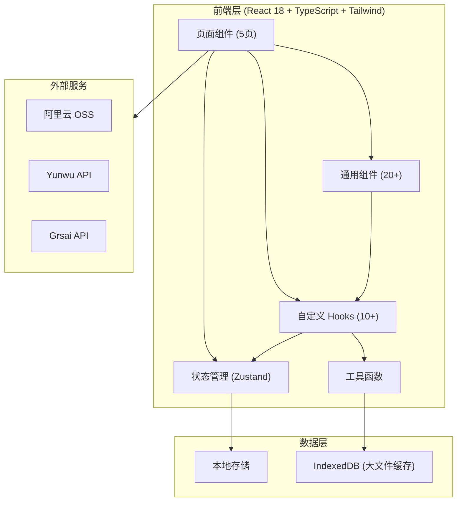

## 1. 架构设计



## 2. 技术说明

- **前端框架**：React@18 + TypeScript
- **构建工具**：Vite@6
- **样式方案**：TailwindCSS@3
- **状态管理**：Zustand@5
- **路由**：react-router-dom@6
- **图标**：lucide-react
- **数据持久化**：localStorage（配置/历史）+ IndexedDB（图片缓存）
- **后端**：无（纯前端应用，对接已有 Visual Forge API）

## 3. 路由定义

| 路由 | 页面名称 | 用途 |
|------|----------|------|
| / | 主图生成工作台 | 主图生图全流程（默认首页） |
| /canvas | 详情页生成画布 | 场景延展、信息图、智能排版 |
| /gallery | 灵感画廊 | 风格库、草稿箱、历史记录 |
| /settings | 系统设置 | API 密钥、任务队列管理 |

## 4. 核心数据模型

### 4.1 类型定义

```typescript
// 引擎/模型
interface AIModel {
  id: string;
  name: string;
  provider: 'yunwu' | 'grsai';
  fallbackModel?: string;
  recommendedFor?: string[];
}

// 画幅预设
interface AspectPreset {
  id: string;
  label: string;
  width: number;
  height: number;
  ratio: string;
  resolution: '1K' | '2K' | '4K';
  scene: string[];
}

// 风格预设
interface StylePreset {
  id: string;
  name: string;
  keywords: string[];
  category: 'cover' | 'infographic' | 'freeform' | 'ppt';
  ratio: string;
  promptTemplate?: string;
  modifier?: string;
  colorTags?: string[];
  industry?: string[];
}

// 参考图
interface ReferenceImage {
  id: string;
  type: 'product' | 'model' | 'reference';
  file?: File;
  previewUrl: string;
  ossUrl?: string;
  name: string;
  size: number;
}

// 生成任务
interface GenerateTask {
  id: string;
  model: AIModel;
  aspectPreset: AspectPreset;
  stylePreset?: StylePreset;
  chinesePrompt: string;
  englishPrompt: string;
  negativePrompt?: string;
  productImages: ReferenceImage[];
  modelImages: ReferenceImage[];
  status: 'pending' | 'optimizing' | 'generating' | 'completed' | 'failed';
  resultUrls: string[];
  seed?: number;
  createdAt: string;
  completedAt?: string;
  error?: string;
  retryCount: number;
}

// 详情页排版项目
interface CanvasProject {
  id: string;
  name: string;
  productRef: ReferenceImage;
  sceneImages: GenerateTask[];
  infographicImages: GenerateTask[];
  detailImages: GenerateTask[];
  layoutTemplate: string;
  finalImageUrl?: string;
  createdAt: string;
}

// 系统配置
interface SystemConfig {
  yunwuApiKey: string;
  yunwuBaseUrl: string;
  grsaiApiKey: string;
  grsaiApiUrl: string;
  defaultProvider: 'auto' | 'yunwu' | 'grsai';
  defaultModel: string;
  ossConfig: {
    accessKeyId: string;
    accessKeySecret: string;
    endpoint: string;
    bucket: string;
  };
}
```

### 4.2 本地存储结构

```typescript
interface LocalStore {
  config: SystemConfig;
  taskHistory: GenerateTask[];
  canvasProjects: CanvasProject[];
  draftTasks: GenerateTask[];  // 草稿箱
  version: string;
}
```

## 5. 组件树

```
App
├── Layout
│   ├── Sidebar (桌面端导航)
│   │   ├── NavItem × 4
│   │   └── TaskQueueIndicator (任务队列徽标)
│   ├── MobileBottomNav (移动端导航)
│   └── Content
│       ├── StudioPage (/)
│       │   ├── ModelEngineSelector
│       │   ├── AspectRatioPanel
│       │   │   ├── PresetButton × N
│       │   │   └── ResolutionSlider
│       │   ├── PromptWorkspace
│       │   │   ├── ChinesePromptEditor
│       │   │   ├── EnglishPromptPreview
│       │   │   ├── OptimizeButton
│       │   │   └── ReversePromptButton
│       │   ├── ReferencePanel
│       │   │   ├── TabBar (商品 / 模特 / 参考)
│       │   │   ├── DropZone
│       │   │   └── ImageGrid
│       │   ├── StylePresetPicker
│       │   │   └── StyleCard × N
│       │   ├── AdvancedControls
│       │   │   ├── NegativePromptInput
│       │   │   └── StyleStrengthSlider
│       │   └── GenerateButton
│       ├── CanvasPage (/canvas)
│       │   ├── ProductLockBar (锁定商品主体)
│       │   ├── ScenarioExtension
│       │   │   ├── ScenarioTemplateGrid
│       │   │   └── CustomScenarioInput
│       │   ├── InfographicConfig
│       │   │   ├── SellingPointList
│       │   │   └── InfographicStylePicker
│       │   ├── DetailCloseupConfig
│       │   └── SmartLayout
│       │       ├── LayoutCanvas
│       │       ├── AssetSidebar
│       │       └── LayoutTemplatePicker
│       ├── GalleryPage (/gallery)
│       │   ├── StyleLibrary
│       │   │   ├── FilterBar
│       │   │   └── StyleCardGrid
│       │   ├── DraftBox
│       │   │   └── DraftTimeline
│       │   └── HistoryList
│       │       ├── HistoryFilter
│       │       └── HistoryCardGrid
│       └── SettingsPage (/settings)
│           ├── ApiKeyForm
│           ├── OssConfigForm
│           └── TaskQueueMonitor
│               ├── TaskProgressList
│               └── TaskDetailModal
└── GlobalComponents
    ├── Toast
    ├── Modal
    ├── ProgressBar
    └── LoadingSpinner
```

## 6. API 模拟层设计

由于对接真实 Visual Forge API，在开发阶段提供模拟层：

```typescript
interface MockAPI {
  submitTask(task: GenerateTask): Promise<{ taskId: string }>;
  getTaskStatus(taskId: string): Promise<{ status: string; resultUrls?: string[] }>;
  optimizePrompt(chinese: string): Promise<string>;
  reversePrompt(imageUrl: string): Promise<string>;
  uploadToOss(file: File): Promise<string>;
}
```
