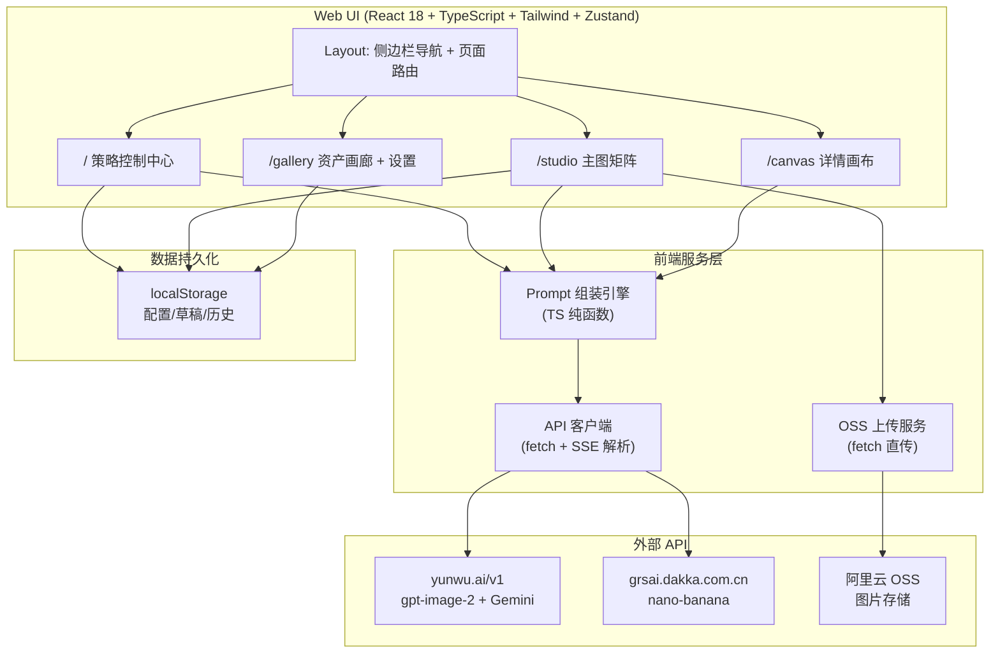

# 全链路电商 AI 视觉物料工作台 — 技术架构文档 v3.0

## 1. 架构概览



## 2. 技术栈

| 层级 | 技术 | 说明 |
|------|------|------|
| 框架 | React@18 + TypeScript | 复用 visual-forge 现有技术栈 |
| 构建 | Vite@6 | HMR 开发体验 |
| 样式 | TailwindCSS@3 | 深色工业风设计系统 |
| 状态 | Zustand@5 | 全局状态 + localStorage 持久化 |
| 路由 | react-router-dom@6 | 4 页面单页应用 |
| 图标 | lucide-react | 统一线性图标 |
| API | 浏览器原生 `fetch` | 零依赖 HTTP 客户端 |
| Prompt 引擎 | TypeScript 纯函数 | 可测试、可独立运行 |
| 存储 | localStorage | 配置/草稿/历史持久化 |

## 3. 路由定义

| 路由 | 页面 | 组件文件 |
|------|------|---------|
| `/` | 策略控制中心 | `src/pages/StrategyCenter.tsx` |
| `/studio` | 主图/副图矩阵工作台 | `src/pages/StudioPage.tsx` (重构) |
| `/canvas` | 智能排版详情画布 | `src/pages/CanvasPage.tsx` (重构) |
| `/gallery` | 资产画廊与设置 | `src/pages/GalleryPage.tsx` (重构) |

## 4. 组件树

```
App
├── Layout
│   ├── Sidebar (桌面) / BottomNav (移动端)
│   │   └── NavItem × 4 (策略控制中心 / 主图矩阵 / 详情画布 / 资产画廊)
│   └── RouterView
│       │
│       ├── StrategyCenter (/)
│       │   ├── ProductInputForm            ← 品类/卖点/受众/证明
│       │   │   └── SellingPointList        ← 动态卖点添加/删除
│       │   ├── DriverDiagnosisCard          ← 驱动力诊断结果
│       │   ├── StyleLockEditor              ← 10 字段可视化编辑
│       │   │   ├── PaletteEditor            ← Hex 色板编辑器
│       │   │   ├── FontSelector             ← 字体下拉选择
│       │   │   └── LightTempToggle          ← 冷暖调开关
│       │   └── ImagePlanTable              ← 12 张图计划预览表
│       │       ├── AngleAllocationDashboard ← 角度分配仪表盘
│       │       └── BackgroundColorIndicator ← 背景色交替指示
│       │
│       ├── StudioPage (/studio)
│       │   ├── MatrixToolbar               ← 顶部操作栏
│       │   ├── HeroImageStack × 5          ← H1-H5 主图堆栈
│       │   │   ├── ImagePreview            ← 生成的预览图
│       │   │   ├── PlatformOverlayToggle   ← 价格区留空开关
│       │   │   ├── LogoCornerToggle        ← Logo 角标开关
│       │   │   └── AngleBadge              ← 角度标签
│       │   ├── ReferenceUploadPanel        ← 商品白底图/模特图上传
│       │   │   └── OSSUploadProgress       ← OSS 上传进度
│       │   ├── NegativePromptPresets       ← 否定词一键勾选
│       │   └── BatchSubmitBar              ← 批量提交 + 进度
│       │
│       ├── CanvasPage (/canvas)
│       │   ├── GeneratorSidebar            ← 左侧生成面板
│       │   │   ├── ModuleList              ← D1-D9 模块列表
│       │   │   └── GenerateButton          ← 逐模块/一键生成
│       │   ├── LayoutCanvas               ← 中间 9:16 画布
│       │   │   ├── CanvasModuleCard × N    ← 可拖拽模块卡片
│       │   │   ├── BackgroundColorBar      ← 背景色交替指示条
│       │   │   └── AlignmentGuides         ← 智能对齐辅助线
│       │   ├── PropertyPanel               ← 右侧属性面板
│       │   │   ├── ModuleDetailView        ← 选中模块的详情
│       │   │   └── ExportButton            ← 导出长图
│       │   └── InfographicPreviewOverlay   ← 信息图引线标注层
│       │
│       └── GalleryPage (/gallery)
│           ├── StyleLibrary                ← 25 模板库
│           │   ├── CategoryFilter          ← 行业/色系筛选
│           │   └── StyleCardGrid           ← 模板卡片网格
│           ├── DraftBox                    ← 草稿箱
│           │   └── DraftTimeline           ← 时间线列表
│           ├── HistoryList                 ← 生成历史
│           │   ├── HistoryFilter           ← 搜索+状态筛选
│           │   └── HistoryCardGrid         ← 历史卡片网格
│           └── SettingsPanel               ← API 密钥/引擎配置
│               ├── ApiKeyForm              ← yunwu/grsai/OSS 配置
│               └── TaskQueueMonitor        ← 任务队列状态
│
└── GlobalComponents
    ├── Toast
    ├── Modal
    └── ProgressBar
```

## 5. 核心模块：Prompt 组装引擎文件结构

```
src/services/ecoprompt/
├── index.ts            ← 统一入口：buildEcoPrompts()
├── driver.ts           ← 驱动力诊断 (5.6)
├── stylelock.ts        ← Style Lock 组装 (5.2)
├── imageplan.ts        ← 图片计划生成 (主图5张 + 详情9屏)
├── camera.ts           ← 多角度镜头分配 (5.4)
├── background.ts       ← 背景色交替 (5.5)
├── singleprompt.ts     ← 单张 Prompt 拼装 (5.3)
├── rules.ts            ← GPT-Image-2 7 条铁律常量
├── sequences.ts        ← 三大驱动序列模板 (H1-H5 主图 + D1-D9 详情)
└── types.ts            ← 全部内部类型定义
```

## 6. 数据流

```
[用户] ──产品信息──→ [ProductInputForm]
                        │
                        ▼
              [diagnoseDriver()]
                        │
                    { driver, confidence, sequence }
                        │
              ┌─────────┼─────────┐
              ▼         ▼         ▼
         [visual]  [painPoint]  [emotional]
              │         │         │
              └─────────┼─────────┘
                        ▼
              [generateImagePlan()]
                        │
                    ImagePlanItem[] (12-14 items)
                        │
                        ▼
              [assembleStyleLock(userConfig)]
                        │
                    StyleLock { lockText, ... }
                        │
                        ▼
              [assignCameraAngles(tasks)]
              [assignBackgroundColors(tasks)]
                        │
                        ▼
              [buildSinglePrompt(task, styleLock)]
                        │
                    prompts: Record<string, string>
                        │
              ┌─────────┼─────────┐
              ▼         ▼         ▼
         [callGptImage2]  →  [callGrsai fallback]
                        │
                    resultUrls: Record<string, string[]>
                        │
                        ▼
              [displayInMatrix / displayInCanvas]
```

## 7. 从现有 visual-forge-web 重构的变更清单

### 7.1 删除

| 文件/目录 | 原因 |
|-----------|------|
| `src/data/constants.ts` 中的 PPT 风格 (ppt_*) | 非电商场景 |
| `src/data/constants.ts` 中的自由生图风格 (freeform_*) | 非结构化拼接 |
| `src/components/studio/StylePicker.tsx` 中的通用风格选择 | 替换为 Style Lock 编辑器 |
| `src/components/studio/PromptWorkspace.tsx` 的通用 prompt 区 | 升级为结构化表单 |
| `src/pages/StudioPage.tsx` 当前实现 | 重构为矩阵主图工作台 |

### 7.2 新增

| 文件/目录 | 内容 |
|-----------|------|
| `src/services/ecoprompt/` | 完整 Prompt 组装引擎 |
| `src/services/api.ts` | 保留并升级（已修正 gpt-image-2/Gemini/Grsai 三个 bug） |
| `src/pages/StrategyCenter.tsx` | 全新页面：驱动力诊断 + Style Lock |
| `src/components/strategy/ProductInputForm.tsx` | 产品信息输入表单 |
| `src/components/strategy/DriverDiagnosisCard.tsx` | 驱动力结果卡片 |
| `src/components/strategy/StyleLockEditor.tsx` | 10 字段风格锁编辑器 |
| `src/components/strategy/ImagePlanTable.tsx` | 图片计划预览表 |
| `src/components/studio/HeroImageStack.tsx` | 单张主图堆栈组件 |
| `src/components/studio/PlatformOverlayToggle.tsx` | 合规 Overlay 开关 |
| `src/components/studio/NegativePresets.tsx` | 否定词预设选择 |
| `src/components/canvas/GeneratorSidebar.tsx` | 详情页模块生成侧边栏 |
| `src/components/canvas/LayoutCanvas.tsx` | 可拖拽智能排版画布 |
| `src/components/canvas/CanvasModuleCard.tsx` | 画布上的模块卡片 |
| `src/components/canvas/BackgroundColorBar.tsx` | 背景色交替指示条 |
| `src/data/templates.ts` | 25 个场景模板的 TS 常量导出 |
| `src/types/eco-types.ts` | 电商专属类型定义 |

### 7.3 修改

| 文件 | 变更 |
|------|------|
| `src/store/useAppStore.ts` | 新增 `convertDiagnosis`, `styleLock`, `imagePlan`, `ecoTaskQueue` 状态 |
| `src/App.tsx` | 路由从 4 条改为 4 条新路由 |
| `src/components/Layout.tsx` | 导航项更新 |
| `src/services/api.ts` | 已在之前修正了 3 个 API 调用 bug |

## 8. 开发计划

| 阶段 | 内容 | 工时 |
|------|------|------|
| **Sprint 1** | Prompt 组装引擎 (`ecoprompt/`) + 驱动力诊断 | P0 |
| **Sprint 2** | Style Lock 编辑器 + 图片计划表 UI | P0 |
| **Sprint 3** | 主图矩阵工作台 + 合规 Overlay + 负面词 | P0 |
| **Sprint 4** | 详情画布 Canvas + 拖拽拼接 | P1 |
| **Sprint 5** | 镜头分配/背景交替仪表盘 + 资产画廊 | P1 |
| **Sprint 6** | OSS 上传集成 + 飞书推送 + 测试 | P2-P3 |
